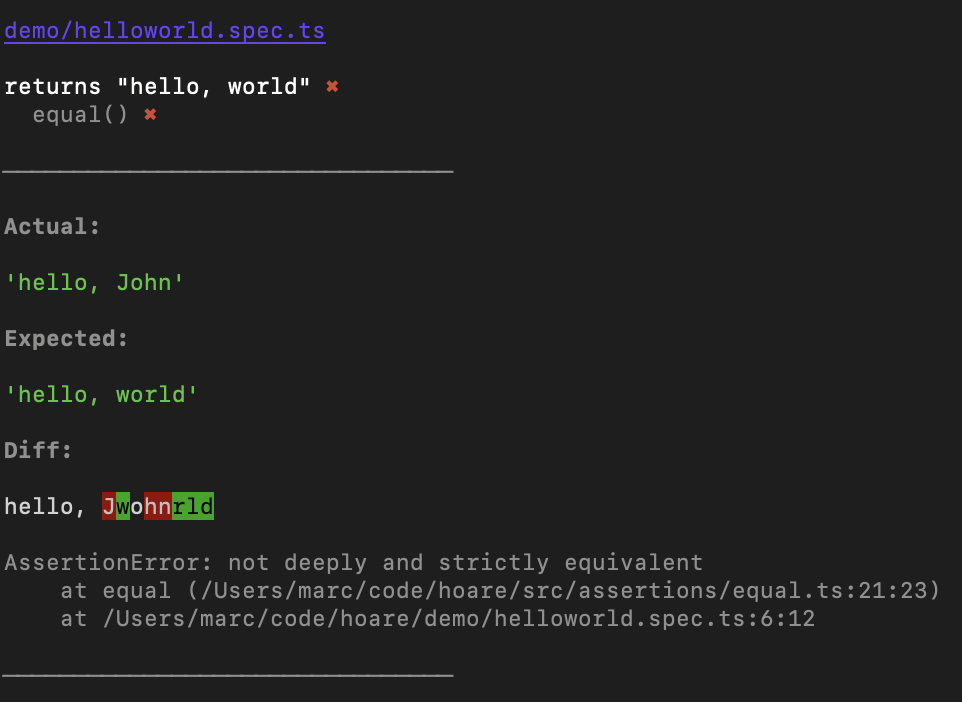

[](https://github.com/mhweiner/hoare/actions)
[](https://github.com/semantic-release/semantic-release)
[](https://conventionalcommits.org)
[]()

A simple, fast, opinionated, and defensive Typescript/Javascript test runner designed to help you to write simple, readable, and maintainable tests. 

**Out-of-the-box Typescript support 🔒**
- Written in and designed around Typescript. No special configuration needed, and no plugins to install. Works great with [c8](https://github.com/bcoe/c8) for code coverage.
- Handles compilation errors gracefully.

**Defensive 🛡**
- Uncaught errors and unhandled promise rejections will cause the test to fail.
- Any spec files without tests, or tests without assertions, result in a failed test.
- Strict and deep equality comparison by default.

**Designed For Speed 🚀**
- Multi-process parallel test runner. Each spec file is run in its own process and runtime for speed and isolation benefits.
- Simple means fast.

**Easy to Use 😃**
- [Very simple assertion API](#api). You shouldn't need to learn a new language to read and write tests. Assertions should be simple axiomatic logic and code, not an English-like poem.
- Built-in [powerful diff visualization tool](#visual-diff-tool).
- Errors or unhandled promise rejections are buffered and grouped under the test file in the output. This helps you know where they came from.
- Clear documentation.

**Opinionated for Quality 🎓**
- No deep nesting of tests. This has the following benefits:
  - Pressures programmers to break apart their code into smaller pieces.
  - Test code becomes much simpler and easier to read and maintain.
  - Output reporting becomes much simpler and easier to read and understand.
- No built-in `before()` and `after()`. [This is a common anti-pattern.](#why-no-built-in-setup-and-teardown)

**Modern Language Features ✨**
  - Async/Await/Promise Support

**Robust & Reliable 💪**
- Small, simple, and modular codebase written in Typescript with minimal dependencies.
- Largely agnostic of other tools and doesn't try to do too much.

[Read more on the inspiration, philosophy and attributions.](#inspiration-philosophy--attribution)

# Examples

See [demo](demo) or [src](src) directories for more examples.

## Hello World

_helloworld.ts_
```typescript
export function helloworld() {
  return 'hello, world';
}
```
_helloworld.spec.ts_
```typescript
import {test} from 'hoare';
import {helloworld} from './helloworld';

test('should return "hello, world"', (assert) => {
  assert.equal(helloworld(), 'hello, world');
});
```
## Valid Word

_isValidWord.ts_
```typescript
import {readFile} from 'fs/promises';

export async function isValidWord(word: string) {
  const validWords = await getValidWords();
  return validWords.indexOf(word) !== -1;
}

async function getValidWords() {
  const contents = await readFile('./dict.txt', 'utf-8');
  return contents.split('\n');
}
```
_isValidWord.spec.ts_
```typescript
import {test} from 'hoare';
import {mock} from 'cjs-mock';
import * as mod from './isValidWord'; // just used for typing

const dict = ['dog', 'cat', 'fish'].join('\n');
const mockMod: typeof mod = mock('./isValidWord', {
    'fs/promises': {readFile: () => Promise.resolve(dict)},
});

test('valid word returns true', async (assert) => {
  const result = await mockMod.isValidWord('dog');
  assert.equal(result, true);
});

test('invalid word returns false', async (assert) => {
  const result = await mockMod.isValidWord('nope');
  assert.equal(result, false);
});
```

# Installation & Setup

1. Install from npm along with peer dependencies:

    ```console
    npm i typescript ts-node c8 hoare -D
    ```
   
2. Make sure your [tsconfig.json](tsconfig.json) file has the following compiler options set:

    ```json
    {
      "module": "CommonJS",
      "sourceMap": true
    }
    
    ```

3. Create an `.c8rc.json` file in the root of your project (or use another config option), following the [c8 documentation](https://github.com/bcoe/c8). For an example, see our [.c8rc.json](.c8rc.json) file.


4. Add the following command to your `package.json` `scripts` directive:

    ```json
    {
      "test": "c8 hoare 'src/**/*.spec.@(ts|js)' && c8 report -r text -r html"
    }
    ```

The above command, along with our [.c8rc.json](.c8rc.json) file settings, will do the following:

1. Run `c8` for code coverage.
2. Run any  `.spec.js` or `.spec.ts` file within the `src` folder, recursively.
3. If the test is successful, generate both an HTML and text coverage report.

You can customize the above command to your situation. The string in quotes is a [glob](https://github.com/terkelg/tiny-glob).

# Basic Usage

1. Write your tests with a `.spec.ts` or `.spec.js` extension (although any extension will work, as long as it matches your glob in your `npm test` script and your coverage configuration). We recommend you put your source code in a `src` folder and your spec files alongside the source, and not in a separate test folder.
2. Simply run `npm test`.

Example:

```
dist
src
  foo.ts
  foo.spec.ts
```

# API

## Methods

### `test(title: string, cb: (assert: Assert) => void): void`

Create a test. `cb` can be an `async` function.

## Interfaces

### `Assert`

#### `equal(actual: any, expected: any, msg?: string): void`

Asserts deep and strict equality on objects or primitives. This will give you a [visual diff](#visual-diff-tool) output for any discrepancies.

#### `throws(experiment: () => any, expectedError: Error, msg?: string): void`

Asserts that the function `experiment` throws an error that is equivalent to `expectedError`, ignoring stack traces.

Example:

```typescript
import {test} from 'hoare';

function mustBe42(num: number): void {
  if (num !== 42) {
    throw new Error('expected 42');
  }
}

test('mustBe42()', (assert) => {
  assert.equal(mustbe42(42), undefined, 'should not throw if 42');
  assert.throws(() => mustBe42(15), new Error('expected 42'), 'should throw if not 42');
});
```

#### `errorsEquivalent(err1: any, err2: any, msg?: string)`

|📝 You may want to use `throws()` instead of this method for convenience, as this will catch the error for you without need to wrap it in a try/catch block. |
|---------|

Asserts that both errors are similar. Similar to `equal()`, but stack traces are ignored. It checks for both non-enumerable properties
(ie, `name` and `message`) and enumerable properties (anything added by extending `Error`).

Both errors **must** be an instance of `Error`, or an error will be thrown.

# Visual Diff Tool

When using `equal()` or `errorsEquivalent()`, you will get a visual output that cleary shows the expected value, actual value, and difference.




# Inspiration, Philosophy & Attribution

`hoare` is named after [Sir Tony Hoare](https://en.wikipedia.org/wiki/Tony_Hoare) (aka C. A. R. Hoare), and the [Hoare triple](https://en.wikipedia.org/wiki/Hoare_logic), the cornerstone of Hoare's axiomatic method of testing computer programs (what we largely consider unit testing today).

After years of working on [safety-critical](https://en.wikipedia.org/wiki/Safety-critical_system) and mission-critical software in healthcare, finance, and e-commerce, I have come to appreciate the importance of simple, readable, and maintainable unit tests and the profound effect they can have on design.

> The real value of tests is not that they detect bugs in the code, but that they detect inadequacies in the methods, concentration, and skills of those who design and produce the code. — C. A. R. Hoare

Good unit tests force programmers to break apart their code into smaller, more easily testable parts. Unfortunately, testing frameworks have become ever-complex to address deficiencies in design, instead of helping to address them.

> Inside every large program, there is a small program trying to get out. — C. A. R. Hoare

A unit test should act as a **_specification_** for the behavior of the code that we're testing. The Hoare triple, written as `{P}C{Q}`, provides a way for us to specify this expected behavior. Each part is a logical statement that must be true for the test to pass: `pre-condition`, `execution`, and `post-condition`. The Hoare triple is an easy way to specify how a piece of code should behave, and a good unit test should clearly communicate this to the reader. I often use `given`, `when`, `then` in my unit tests.

Not only are confusing tests not helpful in specification, they also lead to technical debt, test abandonment, or errors in the test itself.

Reliability in software—in tests **and** source code—is largely predicated on its simplicity and clarity in **human** understanding.

> There are two ways of constructing a software design: one way is to make it so simple that there are obviously no deficiencies and the other is to make it so complicated that there are no obvious deficiencies. — C. A. R. Hoare

> There is nothing a mere scientist can say that will stand against the flood of a hundred million dollars. But there is one quality that cannot be purchased in this way — and that is reliability. The price of reliability is the pursuit of the utmost simplicity. It is a price which the very rich find most hard to pay. — C. A. R. Hoare

Inspiration was also taken from the following:

- [Rethinking Unit Test Assertions](https://medium.com/javascript-scene/rethinking-unit-test-assertions-55f59358253f) by [Eric Elliot](https://medium.com/@_ericelliott).
- Other test frameworks [tape](https://github.com/substack/tape), [AVA](https://github.com/avajs/ava) and [node-tap](https://github.com/tapjs/node-tap).

# Why no built-in setup and teardown?

The use of setup() and teardown() or before() and after() methods in unit tests is often considered an anti-pattern [[1](https://jamesnewkirk.typepad.com/posts/2007/09/why-you-should-.html), [2](https://stackoverflow.com/questions/1087317/do-setup-teardown-hurt-test-maintainability), [3](https://medium.com/@jameskbride/testing-anti-patterns-b5ffc1612b8b)]. These methods are typically used to set up and tear down the test environment before and after each test case. While they may seem convenient at first, they can lead to several issues:

- Unit tests should be idempotent and non-destructive. They should not require a setup or teardown in the first place. If you're using one, it probably means you're running an integration test and doing stateful things, such as touching a database or changing a file on disk. (If you do intened to write an integration test, keep reading, we'll address this.)

- Hidden dependencies: When using setup() and teardown() methods, the dependencies between test cases are not explicit. This can make it difficult to understand and reason about the test suite as a whole. It becomes harder to identify which tests rely on specific setup steps and which tests may be affected by changes in the teardown process.

- Test pollution: setup() and teardown() methods can introduce test pollution, where changes made in one test case affect the outcome of subsequent test cases. This can lead to unreliable and unpredictable test results, making it harder to isolate and identify the root cause of failures.

- Complexity and maintenance: As the test suite grows, the complexity of managing the setup and teardown methods increases. It becomes harder to ensure that the test environment is properly set up and cleaned up for each test case. This can result in fragile tests that are difficult to maintain and modify.

Instead of using setup() and teardown() or before() and after() methods, it is recommended to follow the principles of Arrange-Act-Assert (AAA) in unit testing. Each test case should explicitly set up the necessary preconditions, perform the actions being tested, and assert the expected outcomes. This approach makes the dependencies between test cases explicit and promotes better test isolation and maintainability.

By avoiding the use of setup() and teardown() or before() and after() methods, you can write more focused and reliable unit tests that are easier to understand, maintain, and debug.

If you still need a re-useable function, such as for your integration tests, you can of course just write your own. It's just a function, after all! Why should a framework provide that?

```
function setup() {
  // do your dirty deeds
}
function teardown() {
  // do your dirty deeds
}
```

# Ways to Contribute

- Submit an [issue](https://github.com/mhweiner/hoare/issues) with your feature request or bug report
- Issue a PR against `master` and request review. Make sure all tests pass and coverage is good.
- Write about unit testing best practices and use hoare in your examples

Together we can make software more reliable and easier to maintain!

# License

MIT © Marc H. Weiner

[See full license](LICENSE)
